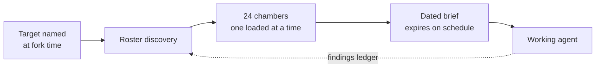

**I take things that are normally gated, hoarded, or rented — and ship free, self-hosted versions. Then I publish the method.**

*No VC. No boss. Just code and conviction.* · [vibemaestro.app](https://vibemaestro.app) · [osintnet.uk](https://osintnet.uk) · [Bluesky](https://bsky.app/profile/indica.osintnet.uk)

---

## <picture><source media="(prefers-color-scheme: dark)" srcset="https://raw.githubusercontent.com/indicaindependent/indicaindependent/main/assets/icons/target-dark.svg"></picture> The mission

I work for the **Vulnerable Defense League of NY**. Most of what is on this page exists to serve that: intelligence and tooling handed to the people who normally cannot buy it.

> **What Wall Street hoards, we hand back.**

That sentence is from [tuck](https://github.com/IndicaIndependent/tuck), but it is the whole account's thesis. Congressional trades, conflict data, surveillance contracts, crisis resources, film archives — all of it is information someone else charges rent on.

**[The VPDLNY Open Tools Mission](https://github.com/IndicaIndependent/vpdlny-tools)** — the architecture and philosophy behind all of it.

---

## <picture><source media="(prefers-color-scheme: dark)" srcset="https://raw.githubusercontent.com/indicaindependent/indicaindependent/main/assets/icons/bolt-dark.svg"></picture> Everything here is actually running

<b>The same measurements as a table</b>

| Service | Status | Response time | Payload |
|---|---|---:|---:|
| [skylens.osintnet.uk](https://skylens.osintnet.uk) | HTTP 200 | 189 ms | 15,119 B |
| [osintnet.uk](https://osintnet.uk) | HTTP 200 | 205 ms | 35,056 B |
| [skygive.app](https://skygive.app) | HTTP 200 | 260 ms | 19,804 B |
| [vibemaestro.app](https://vibemaestro.app) | HTTP 200 | 266 ms | 39,810 B |
| [tuck.osintnet.uk](https://tuck.osintnet.uk) | HTTP 200 | 395 ms | 80,785 B |
| [warheatmap.app](https://warheatmap.app) | HTTP 200 | 563 ms | 40,828 B |
| [blueboxd.com](https://blueboxd.com) | HTTP 200 | 4480 ms | 166,396 B |

Measured 2026-08-26 18:36 EDT. Response time and payload are single direct measurements from one location, not an uptime average. Payload size is listed because a live host can still return an empty stub — a 200 alone proves nothing.

---

## <picture><source media="(prefers-color-scheme: dark)" srcset="https://raw.githubusercontent.com/indicaindependent/indicaindependent/main/assets/icons/stack-dark.svg"></picture> The Gun Slinger — agent architecture

> ### [**the-gun-slinger**](https://github.com/IndicaIndependent/the-gun-slinger)
> **A universal, forkable orchestra-agent architecture.** 24 master skillsets, one loaded at a time, each carrying a dated researched brief that expires. Fork it, name your target, and the build discovers its own roster.

Fourteen numbered chapters, a creed that *is* the architecture rather than a mission statement bolted on, and an asset card for every diagram. Chapter 14 is the empirical one — a measurement of a running instance, including the failures.

---

## <picture><source media="(prefers-color-scheme: dark)" srcset="https://raw.githubusercontent.com/indicaindependent/indicaindependent/main/assets/icons/shield-dark.svg"></picture> Mission work

<table>
<tr>
<td width="50%" valign="top">

### [Tuck](https://tuck.osintnet.uk)
**Free financial intelligence.** Congressional trades, sector heat, a geopolitical scanner, macro, and a tool-wired guide — in a single Cloudflare Worker.

No login. No ads. No advice.

`congressional disclosure` · `OSINT` · `single-file worker`

</td>
<td width="50%" valign="top">

### [Crisis Lifeline Bridge](https://github.com/IndicaIndependent/crisis-lifeline-bridge)
**Verify before you refer.** Detects a person in acute crisis, finds a *real* local agency through live research, then phone-verifies that it answers before handing over the referral.

A wrong number in a crisis is worse than no number.

`agent skill` · `crisis support` · `phone verification`

</td>
</tr>
<tr>
<td width="50%" valign="top">

### [WarHeatMap](https://warheatmap.app)
**Live global conflict intelligence.** Interactive heatmap, naval OSINT, auto-posting — built on verified events rather than headlines.

`conflict data` · `naval OSINT` · `live map`

</td>
<td width="50%" valign="top">

### [Blueboxd](https://blueboxd.com)
**Public-domain cinema, and a film diary that lives in your own Bluesky repo.** Letterboxd on the AT Protocol — your data stays yours.

`AT Protocol` · `public domain` · `data ownership`

</td>
</tr>
</table>

---

## <picture><source media="(prefers-color-scheme: dark)" srcset="https://raw.githubusercontent.com/indicaindependent/indicaindependent/main/assets/icons/globe-dark.svg"></picture> AT Protocol work

Newest line of work — building on Bluesky's open protocol rather than a platform that can revoke access.

| Project | What it is |
|---|---|
| [**Skylens**](https://skylens.osintnet.uk) | Engagement-analytics observatory for Bluesky — timing heatmaps, golden-hour detection. Open source, live now |
| [**Dispatch Line**](https://github.com/IndicaIndependent/dispatch-line) | Autonomous prose-first architecture: one self-contained conversation a day, no engagement bait |
| [**Bluesky Engagement Study**](https://github.com/IndicaIndependent/bluesky-engagement-study) | A receipts-first 30-day study of what actually drives engagement, with a reproducible method |
| [**SkyGive**](https://skygive.app) | Non-custodial Bitcoin donation campaigns for Bluesky — 0% fee |

---

## <picture><source media="(prefers-color-scheme: dark)" srcset="https://raw.githubusercontent.com/indicaindependent/indicaindependent/main/assets/icons/flagship-dark.svg"></picture> VibeMaestro

> ### [**vibemaestro.app**](https://vibemaestro.app)
> **One conductor for a whole ecosystem of AI-native apps.** Describe an app in chat and VibeMaestro builds, ships, and publishes a real, live web app on the Cloudflare edge — tiered model routing, per-user spend caps, and a free build lane so anyone can create for $0.
>
> *Conduct the code. Ship it or it didn't exist.*

<table>
<tr>
<td width="50%" valign="top">

**The platform**
- Chat-to-app studio with live preview and one-click publish
- Tiered LLM routing (Claude · DeepSeek · Workers AI) with per-user spend caps
- Free build lane on Cloudflare Workers AI — zero-cost app creation
- Earned rank ladder: Member → Builder → Advisor → Consult

</td>
<td width="50%" valign="top">

**VibeBuilders ecosystem**
- **VibeBuilders** — the community shipping on VibeMaestro
- **Vibe Jams** — recurring build hackathons
- Reference workers: [model-gateway](https://github.com/IndicaIndependent/vibemaestro-model-gateway) · [auth-gate](https://github.com/IndicaIndependent/vibemaestro-auth-gate)

</td>
</tr>
</table>

---

## <picture><source media="(prefers-color-scheme: dark)" srcset="https://raw.githubusercontent.com/indicaindependent/indicaindependent/main/assets/icons/bots-dark.svg"></picture> Autonomous systems

<table>
<tr>
<td width="50%" valign="top">

### AXIOM
An advanced autonomous **Discord moderation intelligence.** Reads a server in real time and catches trolling, harassment, bullying, political charging and spam with confidence-scored classification — while protecting good-faith debate and friendly chatter. Graduated strikes, one-click enforcement.

`real-time gateway` · `AI classification` · `graduated enforcement`

</td>
<td width="50%" valign="top">

### VibeMaestro Build Bot
The Discord bot that lets a whole server **build real web apps from a slash command.** Routes every build through a free, spend-safe model lane, streams progress live, then auto-publishes the finished app to its own subdomain and edits the result back into Discord.

`Discord` · `Cloudflare Workers` · `streaming builds`

</td>
</tr>
</table>

Community bots: **[HumanDefender](https://developers.reddit.com/apps/humandefender)** (Reddit CIB/bot detector) · **[VibesMom](https://bsky.app/profile/vibesmom.osintnet.uk)** (mental-health presence)

---

## <picture><source media="(prefers-color-scheme: dark)" srcset="https://raw.githubusercontent.com/indicaindependent/indicaindependent/main/assets/icons/stack-dark.svg"></picture> Publish the method

Shipping the tool is half of it. These are the patterns themselves, written down so someone else can rebuild them.

**[cf-osint-toolkit](https://github.com/IndicaIndependent/cf-osint-toolkit)** — edge OSINT patterns · **[sovereign-mcp](https://github.com/IndicaIndependent/sovereign-mcp)** — hardened MCP server template · **[iim-trophy](https://github.com/IndicaIndependent/iim-trophy)** — self-hosted profile trophies, built to stop depending on someone else's host · **[open-agents.dev](https://open-agents.dev)** — agent tooling

---

### Stack

**Information is the weapon. Tools belong to the vulnerable.**

<picture><source media="(prefers-color-scheme: dark)" srcset="https://raw.githubusercontent.com/indicaindependent/indicaindependent/main/assets/icons/mail-dark.svg"></picture> [vibemaestro.app](https://vibemaestro.app) · [osintnet.uk](https://osintnet.uk) · [@indica.osintnet.uk](https://bsky.app/profile/indica.osintnet.uk)

