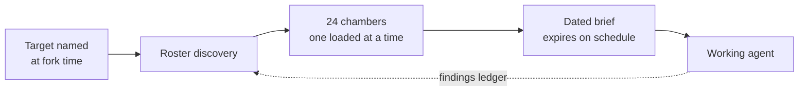

<picture><source media="(prefers-color-scheme: dark)" srcset="https://raw.githubusercontent.com/indicaindependent/indicaindependent/main/assets/brand/header-dark.svg"></picture>

**I take things that are normally gated, hoarded, or rented — and ship free, self-hosted versions. Then I publish the method.**

*No VC. No boss. Just code and conviction.* · [vibemaestro.app](https://vibemaestro.app) · [osintnet.uk](https://osintnet.uk) · [Bluesky](https://bsky.app/profile/indica.osintnet.uk)

---

## <picture><source media="(prefers-color-scheme: dark)" srcset="https://raw.githubusercontent.com/indicaindependent/indicaindependent/main/assets/icons/target-dark.svg"></picture> Indica Independent Media

**Open intelligence, built in the open.** IIM is the house everything here ships under — OSINT research, reporting, and the software that makes both usable by someone who cannot buy a terminal.

> **What Wall Street hoards, we hand back.**

That sentence is from [tuck](https://github.com/indicaindependent/tuck), but it is the whole account's thesis. Congressional trades, conflict data, surveillance contracts, crisis resources, film archives — all of it is information someone else charges rent on.

Some of the work below is done for **VPDLNY**. That part keeps its own counsel; the [tooling](https://github.com/indicaindependent/vpdlny-tools) is public even where the work is not.

`100% Creative Clarity` · [osintnet.uk](https://osintnet.uk) · [Discord](https://discord.osintnet.uk)

---
## <picture><source media="(prefers-color-scheme: dark)" srcset="https://raw.githubusercontent.com/indicaindependent/indicaindependent/main/assets/icons/ka-tet-dark.svg"></picture> Orchestral agentic AI &#8212; the foundation everything else is built on

> ### [**ka-tet**](https://github.com/indicaindependent/ka-tet) &#183; orchestral agentic AI
> **Everything else on this page is built by this.** Four AI agents and one human holding a
> single system upright. The architecture is engineered on the structure of Stephen King's
> *Dark Tower* novels — not as decoration, but because that cosmology is already a
> **hub-and-spoke topology with guarded endpoints, an explicit integrity law, and a named
> failure mode**, which is what a distributed agent system actually needs.

| Seat | Discipline | Cylinder | Publishes |
| :--- | :--- | :--- | :---: |
| The Master | Human owner. May intervene at any hub or spoke | — | — |
| The Dinh | Quantitative analysis. Decides *for* the Master | — | no |
| The Gunslinger | Delegation across disciplines | 24 chambers | no |
| The Second Gunslinger | Dealing with humans | 24 chambers | no |
| The Archivist | Provenance and publication | — | **yes, only** |

**One writer, and that is the load-bearing constraint.** Four seats research, draft, rank and
sanitise. Exactly one may publish. That is a lock rather than a rank, and it was earned — two
writers without one collided on a repository here, and a force-push dropped four files.

**[The Gunslinger](https://github.com/indicaindependent/the-gunslinger)** — the forkable
architecture. 24 chambers, exactly one mounted at a time, **241 dated action items** across 15
numbered chapters. ·
**[The Second Gunslinger](https://github.com/indicaindependent/the-second-gunslinger)** — 24
chambers for people in difficulty; **seven of them fail closed** and hand the action to a human
rather than trusting the model to be careful. ·
**[The Archivist](https://github.com/indicaindependent/the-archivist)** — the publisher, whose
main page is a table of its own recorded mistakes. ·
**[The Gun](https://github.com/indicaindependent/the-gun-skillset-router)** — where the whole
thesis started: the original 24-chamber routing design, drawn before any of it was running.

**The creed is the architecture, not a mission statement bolted on.** Five stanzas, each
mapping to a component and the specific failure it forbids.

| Stanza | Component | Forbids |
| :--- | :--- | :--- |
| I aim with the clock | Time authority | Reading a stale timestamp and calling it now |
| I load with the brief | The chambers | Claiming a discipline you hold only the job title for |
| I fire with the gate | The conformance gate | Counting a file that exists as a capability that works |
| I widen when I am told | Scope lock | Granting yourself authority by reading an instruction generously |
| I answer with what I checked | Line Zero | Every other failure above, upstream of all of them |

*No text from the novels is reproduced; the creed is original and the avatars are original
designs. [Attribution](https://github.com/indicaindependent/ka-tet/blob/main/ATTRIBUTION.md).*

---

## <picture><source media="(prefers-color-scheme: dark)" srcset="https://raw.githubusercontent.com/indicaindependent/indicaindependent/main/assets/icons/globe-dark.svg"></picture> WarHeatMap

> ### [**warheatmap.app**](https://warheatmap.app)
> **Live global conflict intelligence, free.** An interactive heatmap built on **4,000+ verified
> conflict events** rather than headlines, with naval OSINT and autonomous posting on top.
>
> The most-used thing on this page. No login, no paywall, no ads.

`conflict data` · `naval OSINT` · `live map` · `verified events, not headlines`

---

## <picture><source media="(prefers-color-scheme: dark)" srcset="https://raw.githubusercontent.com/indicaindependent/indicaindependent/main/assets/icons/bots-dark.svg"></picture> AXIOM

> ### [**AXIOM**](https://github.com/indicaindependent/axiom)
> **Autonomous Discord moderation intelligence.** Reads a server in real time and catches
> trolling, harassment, bullying, political charging and spam with confidence-scored
> classification — **while protecting good-faith debate and friendly chatter**, which is the
> hard half. Graduated strikes, one-click enforcement.

The interesting part is the restraint: a moderator that cannot tell an argument from an attack
is worse than no moderator. AXIOM publishes its discipline and keeps its calibration private.

Companion: [**axiom-scanner**](https://github.com/indicaindependent/axiom-scanner) — a free,
read-only web-security scanner you run from Discord.

| Worker | What it runs | Size | Last deployed |
| :--- | :--- | ---: | :---: |
| `axiom-bot` | AXIOM — Discord moderation intelligence | 29,853 B | 2026-08-23 |
| `axiom-scanner` | Free read-only web-security scanner | 24,253 B | 2026-08-21 |

*Read off the running deployments via the Cloudflare API on 2026-09-03, not copied from a doc.*

`real-time gateway` · `AI classification` · `graduated enforcement`

---

## <picture><source media="(prefers-color-scheme: dark)" srcset="https://raw.githubusercontent.com/indicaindependent/indicaindependent/main/assets/icons/flagship-dark.svg"></picture> VibeMaestro

> ### [**vibemaestro.app**](https://vibemaestro.app)
> **My own complete vibe-coding and orchestral AI studio.** Describe an app in chat and
> VibeMaestro builds, ships, and publishes a real, live web app on the Cloudflare edge —
> tiered model routing, per-user spend caps, and a free build lane so anyone can create for $0.
>
> *Conduct the code. Ship it or it didn't exist.*

**One conductor, 23 deployed workers.** Enumerated live on 2026-09-03.

| Function | Workers | Components |
| :--- | ---: | :--- |
| Build &amp; preview | 7 | app, apps, jam, preview, publish, tuner, waitroom |
| Gateway &amp; site | 5 | gw, site, mcp, skills, research |
| Data &amp; storage | 4 | data, db, backup, assets |
| Operations | 3 | status, watchdog, billing |
| Security &amp; secrets | 3 | *names withheld deliberately* |
| Bot | 1 | bot |

*Counting the security components is honest; naming them hands over a map.*

<table>
<tr>
<td width="50%" valign="top">

**The platform**
- Chat-to-app studio with live preview and one-click publish
- Tiered LLM routing (Claude · DeepSeek · Workers AI) with per-user spend caps
- Free build lane on Cloudflare Workers AI — zero-cost app creation
- Earned rank ladder: Member → Builder → Advisor → Consult

</td>
<td width="50%" valign="top">

**VibeBuilders ecosystem**
- **VibeBuilders** — the community shipping on VibeMaestro
- **Vibe Jams** — recurring build hackathons
- **[Build Bot](https://github.com/indicaindependent/vibemaestro)** — build real web apps from a Discord slash command
- Reference workers: [model-gateway](https://github.com/indicaindependent/vibemaestro-model-gateway) · [auth-gate](https://github.com/indicaindependent/vibemaestro-auth-gate)

</td>
</tr>
</table>

---

## <picture><source media="(prefers-color-scheme: dark)" srcset="https://raw.githubusercontent.com/indicaindependent/indicaindependent/main/assets/icons/kelvin-dark.svg"></picture> Financial work

> ### [**Kelvin**](https://github.com/indicaindependent/kelvin) &#183; [kelvinquant.com](https://kelvinquant.com)
> **A trading machine under supervision, and the instrumentation that holds it to account.**
> Indexed equity curve, expectancy, Sharpe, Sortino, maximum drawdown, R-multiple and regime
> conditioning, with per-strategy attribution and a machine-decision log.

The interesting behaviour is the refusal. Kelvin **benches negative-expectancy strategies** and
**declines to trade in violent regimes** — a system whose most important capability is not
acting. Same principle as [AXIOM](https://github.com/indicaindependent/axiom): publish the
discipline, keep the calibration private.

The [**hub repo**](https://github.com/indicaindependent/kelvin) writes that boundary down — what
is published, what is withheld, and why the equity curve is *absent* rather than estimated where
no indexed export exists. It is also built to be read by machines: the front end ships an
[`llms.txt`](https://kelvinquant.com/llms.txt) describing itself, and the crawler policy admits
AI agents deliberately.

> **Machine in supervised training.** Figures are indexed demo units — equity indexed to 100,
> daily P&L in percent — **not account balances**. Not financial advice.

Free financial intelligence for everyone else: [**Tuck**](https://tuck.osintnet.uk) — congressional
trades, sector heat, a geopolitical scanner and macro, in a single Cloudflare Worker. No login,
no ads, no advice.

`quant observability` · `risk analytics` · `regime conditioning`

---

## <picture><source media="(prefers-color-scheme: dark)" srcset="https://raw.githubusercontent.com/indicaindependent/indicaindependent/main/assets/icons/bolt-dark.svg"></picture> Everything here is actually running

<b>The same measurements as a table</b>

| Service | Status | Response time | Payload |
|---|---|---:|---:|
| [bizher.osintnet.uk](https://bizher.osintnet.uk) | HTTP 200 | 60 ms | 125,786 B |
| [skylens.osintnet.uk](https://skylens.osintnet.uk) | HTTP 200 | 69 ms | 15,119 B |
| [vibemaestro.app](https://vibemaestro.app) | HTTP 200 | 74 ms | 39,810 B |
| [skygive.app](https://skygive.app) | HTTP 200 | 81 ms | 19,804 B |
| [blueboxd.com](https://blueboxd.com) | HTTP 200 | 102 ms | 166,396 B |
| [tuck.osintnet.uk](https://tuck.osintnet.uk) | HTTP 200 | 225 ms | 80,783 B |
| [kelvinquant.com](https://kelvinquant.com) | HTTP 200 | 260 ms | 8,243 B |
| [osintnet.uk](https://osintnet.uk) | HTTP 200 | 353 ms | 45,118 B |
| [warheatmap.app](https://warheatmap.app) | HTTP 200 | 464 ms | 44,662 B |

Measured 2026-09-08. Response time and payload are single direct measurements from one location, not an uptime average. Payload size is listed because a live host can still return an empty stub — a 200 alone proves nothing.

---

## <picture><source media="(prefers-color-scheme: dark)" srcset="https://raw.githubusercontent.com/indicaindependent/indicaindependent/main/assets/icons/shield-dark.svg"></picture> Tools that get used

| Project | Serves | What it is |
| :--- | :--- | :--- |
| [**Tuck**](https://tuck.osintnet.uk) | anyone priced out of financial intelligence | congressional trades, sector heat, geopolitical scanner, macro |
| [**BizHer**](https://bizher.osintnet.uk) | women forming an LLC in New York | step-by-step filing wizard plus the WBE/MWBE path most guides skip |
| [**Crisis Lifeline Bridge**](https://github.com/indicaindependent/crisis-lifeline-bridge) | agents that may meet someone in crisis | finds a *real* local agency, then phone-verifies it answers before referring |
| [**Skylens**](https://skylens.osintnet.uk) | anyone reading Bluesky seriously | engagement-analytics observatory — timing heatmaps, golden-hour detection |
| [**SkyGive**](https://skygive.app) | anyone raising money without a middleman | non-custodial Bitcoin donation campaigns, **0% fee** |

**A wrong number in a crisis is worse than no number.** That is why the Crisis Lifeline Bridge
phone-verifies before it hands anything over, and why seven of the Second Gunslinger's chambers
fail closed instead of improvising.

---

## <picture><source media="(prefers-color-scheme: dark)" srcset="https://raw.githubusercontent.com/indicaindependent/indicaindependent/main/assets/icons/stack-dark.svg"></picture> Also built, and the method behind it

Shipping the tool is half of it. These are the patterns themselves, written down so someone else can rebuild them.

| | |
| :--- | :--- |
| [**Blueboxd**](https://blueboxd.com) | Public-domain cinema with a film diary that lives in your own Bluesky repo — a Letterboxd-style social layer, so your data stays yours |
| [**Dispatch Line**](https://github.com/indicaindependent/dispatch-line) | Autonomous prose-first architecture: one self-contained conversation a day, no engagement bait |
| [**Bluesky Engagement Study**](https://github.com/indicaindependent/bluesky-engagement-study) | A receipts-first 30-day study of what actually drives engagement, with a reproducible method |
| [**cf-osint-toolkit**](https://github.com/indicaindependent/cf-osint-toolkit) | Cloudflare Workers patterns for building OSINT tools at the edge |
| [**sovereign-mcp**](https://github.com/indicaindependent/sovereign-mcp) | Hardened MCP server template — defensive defaults, not a demo |
| [**PodCheck**](https://github.com/indicaindependent/podcheck) | Independent pre-screen for vape packaging: reads the state track-and-trace code and asks the registry directly |

---

<picture><source media="(prefers-color-scheme: dark)" srcset="https://raw.githubusercontent.com/indicaindependent/indicaindependent/main/assets/brand/stack-dark.svg"></picture>

**Information is the weapon. Tools belong to the vulnerable.**

<picture><source media="(prefers-color-scheme: dark)" srcset="https://raw.githubusercontent.com/indicaindependent/indicaindependent/main/assets/icons/mail-dark.svg"></picture> [vibemaestro.app](https://vibemaestro.app) · [osintnet.uk](https://osintnet.uk) · [@indica.osintnet.uk](https://bsky.app/profile/indica.osintnet.uk) &#183; [Discord](https://discord.osintnet.uk)

