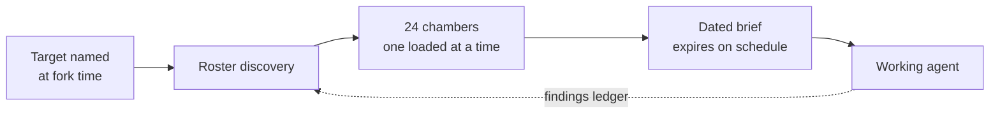

<picture><source media="(prefers-color-scheme: dark)" srcset="https://raw.githubusercontent.com/indicaindependent/indicaindependent/main/assets/brand/header-dark.svg"></picture>

**I take things that are normally gated, hoarded, or rented — and ship free, self-hosted versions. Then I publish the method.**

*No VC. No boss. Just code and conviction.* · [vibemaestro.app](https://vibemaestro.app) · [osintnet.uk](https://osintnet.uk) · [Bluesky](https://bsky.app/profile/indica.osintnet.uk)

---

## <picture><source media="(prefers-color-scheme: dark)" srcset="https://raw.githubusercontent.com/indicaindependent/indicaindependent/main/assets/icons/target-dark.svg"></picture> The mission

I work for the **Vulnerable Defense League of NY**. Most of what is on this page exists to serve that: intelligence and tooling handed to the people who normally cannot buy it.

> **What Wall Street hoards, we hand back.**

That sentence is from [tuck](https://github.com/indicaindependent/tuck), but it is the whole account's thesis. Congressional trades, conflict data, surveillance contracts, crisis resources, film archives — all of it is information someone else charges rent on.

**[The VPDLNY Open Tools Mission](https://github.com/indicaindependent/vpdlny-tools)** — the architecture and philosophy behind all of it.

---
## <picture><source media="(prefers-color-scheme: dark)" srcset="https://raw.githubusercontent.com/indicaindependent/indicaindependent/main/assets/icons/ka-tet-dark.svg"></picture> The ka&#8209;tet &#8212; the foundation everything else is built on

> ### [**ka-tet**](https://github.com/indicaindependent/ka-tet) &#183; orchestral agentic AI
> **Everything else on this page is built by this.** Four AI agents and one human holding a
> single system upright. The architecture is engineered on the structure of Stephen King's
> *Dark Tower* novels — not as decoration, but because that cosmology is already a
> **hub-and-spoke topology with guarded endpoints, an explicit integrity law, and a named
> failure mode**, which is what a distributed agent system actually needs.

| Seat | Discipline | Cylinder | Publishes |
| :--- | :--- | :--- | :---: |
| The Master | Human owner. May intervene at any hub or spoke | — | — |
| The Dinh | Quantitative analysis. Decides *for* the Master | — | no |
| The Gunslinger | Delegation across disciplines | 24 chambers | no |
| The Apprentice | Dealing with humans | 12 chambers | no |
| The Archivist | Provenance and publication | — | **yes, only** |

**One writer, and that is the load-bearing constraint.** Four seats research, draft, rank and
sanitise. Exactly one may publish. That is a lock rather than a rank, and it was earned — two
writers without one collided on a repository here, and a force-push dropped four files.

**[The Gunslinger](https://github.com/indicaindependent/the-gunslinger)** — the forkable
architecture. 24 chambers, exactly one mounted at a time, **241 dated action items** across 15
numbered chapters. ·
**[The Apprentice](https://github.com/indicaindependent/the-apprentice)** — 12 chambers for
people in difficulty; **five of them hand the action to a human** rather than trusting the
model to be careful. ·
**[The Archivist](https://github.com/indicaindependent/the-archivist)** — the publisher, whose
main page is a table of its own recorded mistakes.

**The creed is the architecture, not a mission statement bolted on.** Five stanzas, each
mapping to a component and the specific failure it forbids.

| Stanza | Component | Forbids |
| :--- | :--- | :--- |
| I aim with the clock | Time authority | Reading a stale timestamp and calling it now |
| I load with the brief | The chambers | Claiming a discipline you hold only the job title for |
| I fire with the gate | The conformance gate | Counting a file that exists as a capability that works |
| I widen when I am told | Scope lock | Granting yourself authority by reading an instruction generously |
| I answer with what I checked | Line Zero | Every other failure above, upstream of all of them |

*No text from the novels is reproduced; the creed is original and the avatars are original
designs. [Attribution](https://github.com/indicaindependent/ka-tet/blob/main/ATTRIBUTION.md).*
---

## <picture><source media="(prefers-color-scheme: dark)" srcset="https://raw.githubusercontent.com/indicaindependent/indicaindependent/main/assets/icons/bolt-dark.svg"></picture> Everything here is actually running

<b>The same measurements as a table</b>

| Service | Status | Response time | Payload |
|---|---|---:|---:|
| [skylens.osintnet.uk](https://skylens.osintnet.uk) | HTTP 200 | 189 ms | 15,119 B |
| [osintnet.uk](https://osintnet.uk) | HTTP 200 | 205 ms | 35,056 B |
| [skygive.app](https://skygive.app) | HTTP 200 | 260 ms | 19,804 B |
| [vibemaestro.app](https://vibemaestro.app) | HTTP 200 | 266 ms | 39,810 B |
| [tuck.osintnet.uk](https://tuck.osintnet.uk) | HTTP 200 | 395 ms | 80,785 B |
| [warheatmap.app](https://warheatmap.app) | HTTP 200 | 563 ms | 40,828 B |
| [blueboxd.com](https://blueboxd.com) | HTTP 200 | 4480 ms | 166,396 B |

Measured 2026-08-26 18:36 EDT. Response time and payload are single direct measurements from one location, not an uptime average. Payload size is listed because a live host can still return an empty stub — a 200 alone proves nothing.

---

## <picture><source media="(prefers-color-scheme: dark)" srcset="https://raw.githubusercontent.com/indicaindependent/indicaindependent/main/assets/icons/shield-dark.svg"></picture> Mission work

| Project | Serves | Status | Payload |
| :--- | :--- | :---: | ---: |
| [Tuck](https://tuck.osintnet.uk) | Anyone priced out of financial intelligence | 200 | 81,142 B |
| [Crisis Lifeline Bridge](https://github.com/indicaindependent/crisis-lifeline-bridge) | Agents that may meet someone in crisis | repo only | &#8212; |
| [WarHeatMap](https://warheatmap.app) | Anyone tracking conflict without a paywall | 200 | 44,662 B |
| [BizHer](https://bizher.osintnet.uk) | Women forming an LLC in New York | 200 | 115,010 B |

*Measured live 2026-09-03 18:22 UTC, not asserted.*

<table>
<tr>
<td width="50%" valign="top">

### [Tuck](https://tuck.osintnet.uk)
**Free financial intelligence.** Congressional trades, sector heat, a geopolitical scanner, macro, and a tool-wired guide — in a single Cloudflare Worker.

No login. No ads. No advice.

`congressional disclosure` · `OSINT` · `single-file worker`

</td>
<td width="50%" valign="top">

### [Crisis Lifeline Bridge](https://github.com/indicaindependent/crisis-lifeline-bridge)
**Verify before you refer.** Detects a person in acute crisis, finds a *real* local agency through live research, then phone-verifies that it answers before handing over the referral.

A wrong number in a crisis is worse than no number.

`agent skill` · `crisis support` · `phone verification`

</td>
</tr>
<tr>
<td width="50%" valign="top">

### [WarHeatMap](https://warheatmap.app)
**Live global conflict intelligence.** Interactive heatmap, naval OSINT, auto-posting — built on verified events rather than headlines.

`conflict data` · `naval OSINT` · `live map`

</td>
<td width="50%" valign="top">

### [BizHer](https://bizher.osintnet.uk)
**Free LLC formation for women entrepreneurs in New York.** A step-by-step wizard through the filing, plus the WBE/MWBE certification path most guides leave out.

`legal tech` · `WBE/MWBE` · `document generator`

</td>
</tr>
</table>

---

## <picture><source media="(prefers-color-scheme: dark)" srcset="https://raw.githubusercontent.com/indicaindependent/indicaindependent/main/assets/icons/globe-dark.svg"></picture> AT Protocol work

| Service | What it does | Status | Payload |
| :--- | :--- | :---: | ---: |
| [Skylens](https://skylens.osintnet.uk) | Engagement-analytics observatory for Bluesky | 200 | 15,478 B |
| [SkyGive](https://skygive.app) | Non-custodial Bitcoin donation campaigns, zero fee | 200 | 20,163 B |
| [Blueboxd](https://blueboxd.com) | Public-domain cinema; the diary lives in your repo | 200 | 166,755 B |

*Measured live 2026-09-03 18:22 UTC, not asserted.*

Newest line of work — building on Bluesky's open protocol rather than a platform that can revoke access.

| Project | What it is |
|---|---|
| [**Skylens**](https://skylens.osintnet.uk) | Engagement-analytics observatory for Bluesky — timing heatmaps, golden-hour detection. Open source, live now |
| [**Dispatch Line**](https://github.com/indicaindependent/dispatch-line) | Autonomous prose-first architecture: one self-contained conversation a day, no engagement bait |
| [**Bluesky Engagement Study**](https://github.com/indicaindependent/bluesky-engagement-study) | A receipts-first 30-day study of what actually drives engagement, with a reproducible method |
| [**SkyGive**](https://skygive.app) | Non-custodial Bitcoin donation campaigns for Bluesky — 0% fee |
| [**Blueboxd**](https://blueboxd.com) | Public-domain cinema with a film diary that lives in your own Bluesky repo — a Letterboxd-style social layer, so your data stays yours |

---

## <picture><source media="(prefers-color-scheme: dark)" srcset="https://raw.githubusercontent.com/indicaindependent/indicaindependent/main/assets/icons/flagship-dark.svg"></picture> VibeMaestro

> ### [**vibemaestro.app**](https://vibemaestro.app)
> **One conductor for a whole ecosystem of AI-native apps.** Describe an app in chat and VibeMaestro builds, ships, and publishes a real, live web app on the Cloudflare edge — tiered model routing, per-user spend caps, and a free build lane so anyone can create for $0.
>
> *Conduct the code. Ship it or it didn't exist.*

<table>
<tr>
<td width="50%" valign="top">

**The platform**
- Chat-to-app studio with live preview and one-click publish
- Tiered LLM routing (Claude · DeepSeek · Workers AI) with per-user spend caps
- Free build lane on Cloudflare Workers AI — zero-cost app creation
- Earned rank ladder: Member → Builder → Advisor → Consult

</td>
<td width="50%" valign="top">

**VibeBuilders ecosystem**
- **VibeBuilders** — the community shipping on VibeMaestro
- **Vibe Jams** — recurring build hackathons
- Reference workers: [model-gateway](https://github.com/indicaindependent/vibemaestro-model-gateway) · [auth-gate](https://github.com/indicaindependent/vibemaestro-auth-gate)

</td>
</tr>
</table>

---

## <picture><source media="(prefers-color-scheme: dark)" srcset="https://raw.githubusercontent.com/indicaindependent/indicaindependent/main/assets/icons/bots-dark.svg"></picture> Autonomous systems

<table>
<tr>
<td width="50%" valign="top">

### [AXIOM](https://github.com/indicaindependent/axiom)
An advanced autonomous **Discord moderation intelligence.** Reads a server in real time and catches trolling, harassment, bullying, political charging and spam with confidence-scored classification — while protecting good-faith debate and friendly chatter. Graduated strikes, one-click enforcement.

`real-time gateway` · `AI classification` · `graduated enforcement`

Companion project: [axiom-scanner](https://github.com/indicaindependent/axiom-scanner) — the free read-only web-security scanner.

</td>
<td width="50%" valign="top">

### VibeMaestro Build Bot
The Discord bot that lets a whole server **build real web apps from a slash command.** Routes every build through a free, spend-safe model lane, streams progress live, then auto-publishes the finished app to its own subdomain and edits the result back into Discord.

`Discord` · `Cloudflare Workers` · `streaming builds`

</td>
</tr>
</table>

Community bots: **[HumanDefender](https://developers.reddit.com/apps/humandefender)** (Reddit CIB/bot detector) · **[VibesMom](https://bsky.app/profile/vibesmom.osintnet.uk)** (mental-health presence)

---

## <picture><source media="(prefers-color-scheme: dark)" srcset="https://raw.githubusercontent.com/indicaindependent/indicaindependent/main/assets/icons/kelvin-dark.svg"></picture> Kelvin

**A trading machine under supervision, and the instrumentation that holds it to account.** Kelvin reports indexed performance and risk — equity curve, expectancy, Sharpe, Sortino, maximum drawdown, R-multiple, regime conditioning — with per-strategy attribution and a machine-decision log.

The interesting behaviour is the refusal. Kelvin **benches negative-expectancy strategies** and **declines to trade in violent regimes** — a system whose most important capability is not acting. Same principle as [AXIOM](https://github.com/indicaindependent/axiom): publish the discipline, keep the calibration private.

It is also built to be read by machines, not just people — the front end ships an [`llms.txt`](https://kelvinquant.com/llms.txt) describing itself, and the crawler policy admits AI agents deliberately.

> **Machine in supervised training.** Figures are indexed demo units — equity indexed to 100, daily P&L in percent — **not account balances**. Not financial advice.

`quant observability` · `risk analytics` · `regime conditioning` · [**kelvinquant.com**](https://kelvinquant.com)

---

## <picture><source media="(prefers-color-scheme: dark)" srcset="https://raw.githubusercontent.com/indicaindependent/indicaindependent/main/assets/icons/stack-dark.svg"></picture> Publish the method

Shipping the tool is half of it. These are the patterns themselves, written down so someone else can rebuild them.

**[cf-osint-toolkit](https://github.com/indicaindependent/cf-osint-toolkit)** — edge OSINT patterns · **[sovereign-mcp](https://github.com/indicaindependent/sovereign-mcp)** — hardened MCP server template · **[iim-trophy](https://github.com/indicaindependent/iim-trophy)** — self-hosted profile trophies, built to stop depending on someone else's host · **[open-agents.dev](https://open-agents.dev)** — agent tooling

---

<picture><source media="(prefers-color-scheme: dark)" srcset="https://raw.githubusercontent.com/indicaindependent/indicaindependent/main/assets/brand/stack-dark.svg"></picture>

**Information is the weapon. Tools belong to the vulnerable.**

<picture><source media="(prefers-color-scheme: dark)" srcset="https://raw.githubusercontent.com/indicaindependent/indicaindependent/main/assets/icons/mail-dark.svg"></picture> [vibemaestro.app](https://vibemaestro.app) · [osintnet.uk](https://osintnet.uk) · [@indica.osintnet.uk](https://bsky.app/profile/indica.osintnet.uk)

